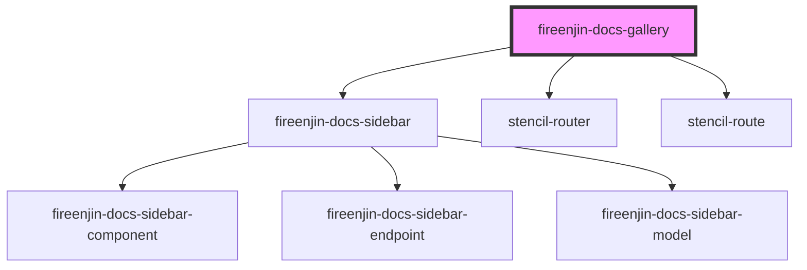

# fireenjin-docs-gallery

<!-- Auto Generated Below -->

## Properties

| Property            | Attribute              | Description | Type                       | Default            |
| ------------------- | ---------------------- | ----------- | -------------------------- | ------------------ |
| `components`        | --                     |             | `ComponentPresetOptions[]` | `[]`               |
| `endpoints`         | --                     |             | `EndpointPresetOptions[]`  | `[]`               |
| `heading`           | `heading`              |             | `string`                   | `'FireEnjin Docs'` |
| `host`              | `host`                 |             | `string`                   | `undefined`        |
| `ionicDocsFilePath` | `ionic-docs-file-path` |             | `string`                   | `undefined`        |
| `models`            | --                     |             | `ModelPresetOptions[]`     | `[]`               |
| `useHash`           | `use-hash`             |             | `boolean`                  | `false`            |

## Dependencies

### Depends on

- [fireenjin-docs-sidebar](../sidebar)
- stencil-router
- stencil-route

### Graph

----------------------------------------------

*Built with [StencilJS](https://stenciljs.com/)*
