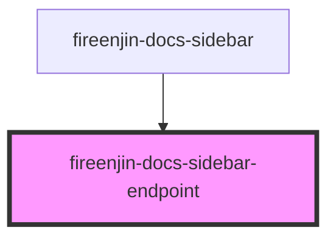

# fireenjin-docs-sidebar-endpoint

<!-- Auto Generated Below -->

## Properties

| Property   | Attribute  | Description | Type                    | Default     |
| ---------- | ---------- | ----------- | ----------------------- | ----------- |
| `endpoint` | --         |             | `EndpointPresetOptions` | `undefined` |
| `host`     | `host`     |             | `string`                | `undefined` |
| `useHash`  | `use-hash` |             | `boolean`               | `false`     |

## Events

| Event            | Description | Type               |
| ---------------- | ----------- | ------------------ |
| `enjinSetPreset` |             | `CustomEvent<any>` |

## Dependencies

### Used by

 - [fireenjin-docs-sidebar](../sidebar)

### Graph

----------------------------------------------

*Built with [StencilJS](https://stenciljs.com/)*
