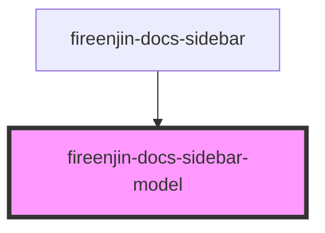

# fireenjin-docs-sidebar-model

<!-- Auto Generated Below -->

## Properties

| Property  | Attribute  | Description | Type                 | Default     |
| --------- | ---------- | ----------- | -------------------- | ----------- |
| `host`    | `host`     |             | `string`             | `undefined` |
| `model`   | --         |             | `ModelPresetOptions` | `undefined` |
| `useHash` | `use-hash` |             | `boolean`            | `false`     |

## Events

| Event            | Description | Type               |
| ---------------- | ----------- | ------------------ |
| `enjinSetPreset` |             | `CustomEvent<any>` |

## Dependencies

### Used by

 - [fireenjin-docs-sidebar](../sidebar)

### Graph

----------------------------------------------

*Built with [StencilJS](https://stenciljs.com/)*
