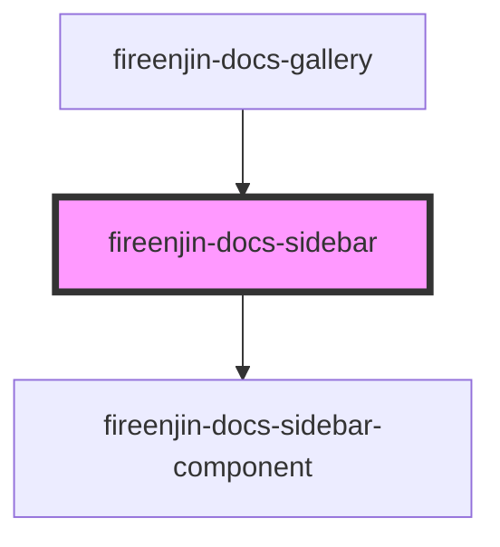

# fireenjin-designer-sidebar

<!-- Auto Generated Below -->

## Properties

| Property     | Attribute    | Description | Type      | Default     |
| ------------ | ------------ | ----------- | --------- | ----------- |
| `components` | `components` |             | `any`     | `[]`        |
| `host`       | `host`       |             | `string`  | `undefined` |
| `useHash`    | `use-hash`   |             | `boolean` | `false`     |

## Dependencies

### Used by

 - [fireenjin-docs-gallery](../gallery)

### Depends on

- [fireenjin-docs-sidebar-component](../sidebar-component)

### Graph

----------------------------------------------

*Built with [StencilJS](https://stenciljs.com/)*
