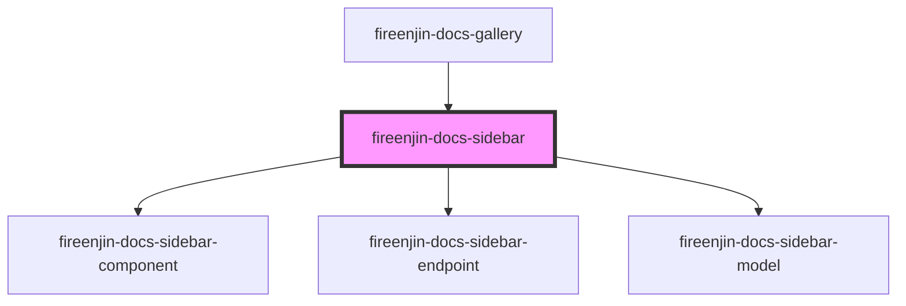

# fireenjin-docs-sidebar

<!-- Auto Generated Below -->

## Properties

| Property     | Attribute  | Description | Type                       | Default     |
| ------------ | ---------- | ----------- | -------------------------- | ----------- |
| `components` | --         |             | `ComponentPresetOptions[]` | `[]`        |
| `endpoints`  | --         |             | `EndpointPresetOptions[]`  | `[]`        |
| `host`       | `host`     |             | `string`                   | `undefined` |
| `models`     | --         |             | `ModelPresetOptions[]`     | `[]`        |
| `useHash`    | `use-hash` |             | `boolean`                  | `false`     |

## Dependencies

### Used by

 - [fireenjin-docs-gallery](../gallery)

### Depends on

- [fireenjin-docs-sidebar-component](../sidebar-component)
- [fireenjin-docs-sidebar-endpoint](../sidebar-endpoint)
- [fireenjin-docs-sidebar-model](../sidebar-model)

### Graph

----------------------------------------------

*Built with [StencilJS](https://stenciljs.com/)*
